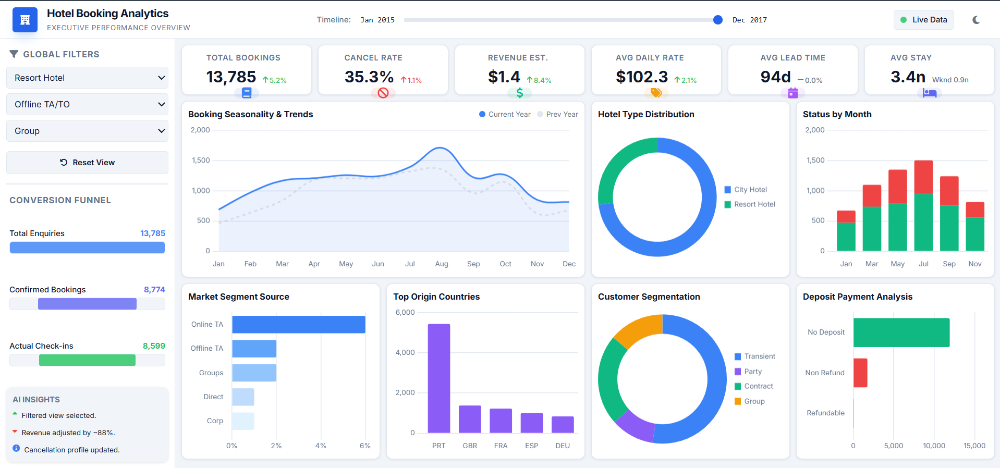

# 🏨 Hotel Booking Analytics Dashboard
## Project Overview

The **Hotel Booking Analytics Dashboard** is an interactive Microsoft Excel Business Intelligence (BI) project designed to analyze hotel booking performance, customer behavior, cancellation trends, booking channels, and revenue metrics.

The dashboard transforms raw hotel booking data into meaningful visual insights, helping hotel managers, revenue analysts, and business stakeholders monitor operational performance and make data-driven decisions.

---
# Problem Statement

Hotel businesses receive thousands of bookings from different customer segments, booking channels, and hotel types. Managing this large volume of data manually makes it difficult to identify booking trends, cancellation patterns, seasonal demand, customer preferences, and revenue opportunities.

The objective of this project is to convert raw hotel booking data into an interactive Excel dashboard that enables users to:

- Monitor overall hotel booking performance
- Analyze booking cancellations
- Track estimated revenue
- Measure Average Daily Rate (ADR)
- Analyze Average Lead Time
- Evaluate Average Stay Duration
- Identify booking seasonality
- Compare Hotel Type performance
- Analyze Market Segments
- Monitor Customer Segmentation
- Analyze Deposit Payment Behavior
- Explore Booking Status by Month

---
# Dataset

The dataset contains hotel reservation and booking records including:

- Booking ID
- Hotel Type
- Arrival Date
- Booking Status
- Lead Time
- Stay Duration
- Adults
- Children
- Country
- Market Segment
- Distribution Channel
- Customer Type
- Deposit Type
- Average Daily Rate (ADR)
- Reservation Status
- Cancellation Status
- Revenue
- Room Type
- Meal Type

---
# Tools and Technologies
| Tool | Purpose |
|------|---------|
| Microsoft Excel |	Dashboard Development & Data Analysis |
| Pivot Tables | Data Aggregation |
| Pivot Charts | Interactive Visualizations |
| Slicers	Dynamic | Filtering |
| Timeline Filter |	Date Analysis |
| Conditional Formatting | KPI Highlighting |
| Doughnut Charts	| Distribution Analysis |
| Line Charts	Booking | Trend Analysis |
| Column Charts	| Monthly Booking Comparison |
| Bar Charts	| Market & Deposit Analysis |
| Form Controls |	Interactive Dashboard Navigation |

---
# Methods
## Data Cleaning
- Removed duplicate records
- Standardized booking dates
- Corrected missing values
- Validated hotel booking records
- Organized booking transactions
  
### Data Transformation

Calculated key business metrics including:

- Total Bookings
- Cancellation Rate
- Estimated Revenue
- Average Daily Rate (ADR)
- Average Lead Time
- Average Stay Duration
- Monthly Bookings
- Booking Status
- Market Segment Contribution
- Customer Segmentation
- Deposit Analysis
  
### Dashboard Development

The dashboard was built using:

✔ Pivot Tables

✔ Pivot Charts

✔ KPI Cards

✔ Interactive Slicers

✔ Timeline Filter

✔ Doughnut Charts

✔ Line Charts

✔ Column Charts

✔ Horizontal Bar Charts

✔ Conditional Formatting

✔ Dynamic Dashboard Layout

---
# Dashboard Preview



---
# Dashboard Output
### KPI Summary
| KPI |	Description|
|--------|--------|
| Total Bookings	| Total number of hotel reservations|
| Cancel Rate | Percentage of cancelled bookings|
| Revenue Estimate	| Estimated hotel revenue|
| Average Daily Rate | Average revenue earned per occupied room|
| Average Lead Time | Average days before arrival when booking was made|
| Average Stay | Average number of nights stayed|

---
# Key Insights
### Booking Performance

The dashboard provides a comprehensive overview of total hotel bookings and booking trends over time.

### Cancellation Analysis

Cancellation Rate helps management identify booking loss patterns and improve reservation strategies.

### Revenue Analysis

Estimated Revenue and ADR help evaluate hotel pricing effectiveness and revenue performance.

### Seasonality

Booking trends clearly highlight seasonal demand fluctuations throughout the year.

### Hotel Type Distribution

The dashboard compares bookings between City Hotels and Resort Hotels.

### Market Segment Analysis

Different booking channels such as Online TA, Offline TA, Groups, Direct, and Corporate are analyzed to identify major booking sources.

### Customer Segmentation

Customer types such as Transient, Contract, Group, and Party are compared to understand customer behavior.

### Deposit Analysis

The dashboard evaluates customer deposit preferences including:

No Deposit
Non Refund
Refundable

### Country Analysis

Top booking origin countries are displayed to identify the largest customer markets.

---
# Dashboard Features
Interactive Filters:
- Hotel Type
- Distribution Channel
- Customer Segment
- Timeline Filter

KPI Cards

Total Bookings

Cancellation Rate

Revenue Estimate

Average Daily Rate

Average Lead Time

Average Stay

Interactive Visualizations

Booking Seasonality Trend

Hotel Type Distribution

Booking Status by Month

Market Segment Source

Top Origin Countries

Customer Segmentation

Deposit Payment Analysis

Additional Features

Dynamic Dashboard

One-Click Reset Filters

Executive Performance Overview

Modern Business Dashboard Design

Responsive Layout

Interactive Charts

---

# Project Structure

```text
Hotel-Booking-Analytics-Dashboard/

├── Dashboard/
│   └── Hotel_Booking_Analytics_Dashboard.xlsx
│
├── Dashboard Preview/
│   └── Hotel_Booking_Analytics_Dashboard.png
│
├── Dataset/
│   └── hotel_bookings.csv
│
├── Documentation/
│   └── Dashboard_Insights.pdf
│
├── Assets/
│   ├── Dashboard_Icons/
│   └── Dashboard_Background/
│
├── README.md
│
├── LICENSE
│
└── .gitignore
```
---
# Result & Conclusion

The Hotel Booking Analytics Dashboard successfully converts raw booking data into an interactive Business Intelligence solution.

This dashboard enables hotel managers and business users to:

- Monitor booking performance
- Analyze cancellation trends
- Track hotel revenue metrics
- Compare hotel types
- Understand customer behavior
- Analyze booking channels
- Evaluate seasonal booking trends
- Support strategic pricing and operational decisions through interactive visualizations

---
# Future Work

Future enhancements for this project include:

- Power BI Dashboard Version
- SQL Database Integration
- Power Query Automation
- Python Data Analysis
- Revenue Forecasting
- Machine Learning-based Cancellation Prediction
- Automated Data Refresh
- Real-Time Booking Dashboard
- Mobile-Friendly Dashboard

---
# Author & Contact
## Vikash Chauhan

**Pursuing MCA (Artificial Intelligence & Machine Learning in Data Science)Student of Chandigarh University**

# Skills

Microsoft Excel • SQL • Power BI • Python • VBA • Data Analytics • Business Intelligence

- LinkedIn: https://www.linkedin.com/in/vikashchauhan01
- GitHub: https://github.com/Vikashchauhan-dev
- Email: Vikashchauhan10211@gmail.com

  ---
⭐ **If you found this project helpful, please give this repository a Star ⭐ and feel free to Fork it for learning purposes!**
